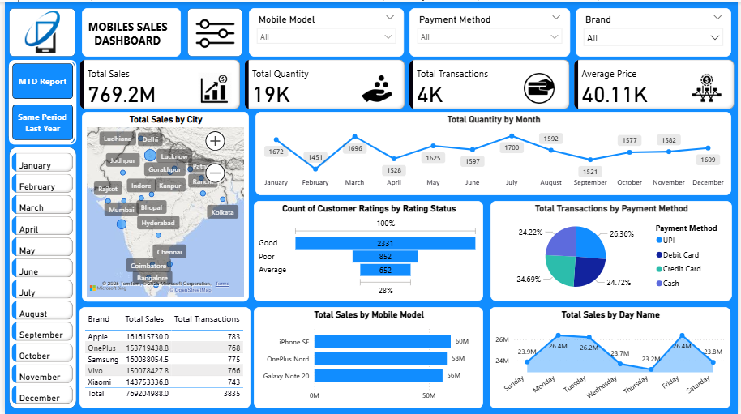

# Mobile Sales Dashboard Project

An interactive Power BI-style dashboard that visualizes mobile sales data with key metrics, filters, and navigable report pages.

---

## Overview

This project displays key mobile sales insights using **cards** and **charts**, accompanied by intuitive **filters**. Users can navigate between three distinct pages to explore different views of the data.

---

## Pages & Navigation

A simple page navigation allows switching between the following:

- **Dashboard** (Page 1)  
  
  This dashboard provides a comprehensive view of mobile sales performance, showcasing key KPIs like total sales, quantity, transactions, and average price.
  It includes interactive filters and diverse visuals such as maps, line charts, bar charts, and pie charts to analyze sales by city, brand, model, payment
  method, and customer ratings.

- **MTD Report** (Page 2 – Month-To-Date)  
  
  Month-to-Date (MTD) Report in Power BI shows performance metrics from the start of the current month up to today, helping track progress within the ongoing
  month.This report highlights total sales, quantity, transactions, and average price with a line chart that displays cumulative growth day by day.

- **Same Period Last Year** (Page 3)  
  (Compare current data to the same period last year)  
  
  Same Period Last Year compares current performance metrics with the corresponding period from the previous year to evaluate growth and trends.
  This report uses tables and bar charts to show sales and quantity comparisons by year, quarter, and month, highlighting year-over-year changes in performance.

---

## Metrics (Cards)

The dashboard features summary cards for:

- **Total Sales** : '769.2M'
- **Total Quantity** : '19K'
- **Total Transactions** : '4K' 
- **Average Price** : '40.11K' 

---

## Filters

Users can refine the visuals using:

- **Month Name** – filter data by calendar month  
- **Mobile Model** – specific model of the mobile device (Galaxy S21,iPhone 11,Mi 11,OnePlus 9, etc.)
- **Brand** – manufacturer of the mobile device (Apple,OnePlus,Samsung,Vivo, etc.)
- **Payment Method** – payment type used (e.g., Cash, Card, UPI, etc.)

